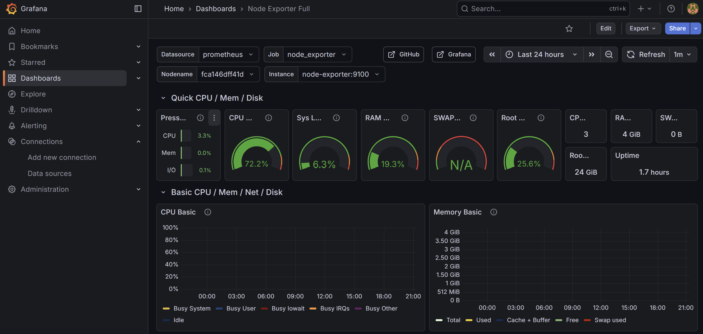

# Home Cloud Server

A personal home server for file storage, system monitoring, and automated backups. Built with Docker on a Ubuntu Server VM running inside VirtualBox.

> **Status:** Work in progress — core services are running, backups and notifications are planned.

---

## What it does

- **File storage** — upload and manage files through a web browser
- **System monitoring** — track CPU, RAM, and disk usage with live dashboards
- **Container management** — manage Docker containers through a web UI
- **Backups** _(planned)_ — automated daily backups with cloud upload
- **Notifications** _(planned)_ — alerts when disk space runs low

---

## Architecture


---

## Screenshots

### Grafana – monitoring dashboard


---

## How it's set up

A physical PC runs VirtualBox, which hosts an Ubuntu Server 24.04 VM. The VM uses a bridged network adapter so it appears as a real device on the local network. All services run as Docker containers managed with Docker Compose.

Remote access is handled via SSH — from a laptop or phone using Termius.

---

## Services

| Service | What it does | Port |
|---|---|---|
| FileBrowser | Web UI for managing files | 8080 |
| Portainer | Web UI for managing Docker | 9443 |
| Node Exporter | Collects system metrics | 9100 |
| Prometheus | Stores and queries metrics | 9090 |
| Grafana | Displays metrics as dashboards | 3000 |

### How monitoring works

```
System (CPU, RAM, disk)
        ↓
  Node Exporter        — reads system stats and exposes them
        ↓
    Prometheus         — scrapes and stores the data
        ↓
     Grafana           — visualizes everything as charts
```

---

## Project structure

```
.
├── docker-compose.yml
├── .env                        # secrets (not in repo)
├── assets/                     # diagrams and screenshots
├── filebrowser/
│   ├── config/settings.json
│   ├── data/
│   └── db/
├── monitoring/
│   ├── prometheus/
│   │   └── prometheus.yml
│   └── grafana/                # grafana data (not in repo)
├── portainer/
│   └── data/                   # portainer data (not in repo)
├── backups/
└── scripts/
```

---

## Getting started

1. Clone the repo
2. Create a `.env` file with your credentials:

```env
GF_SMTP_USER=your@email.com
GF_SMTP_PASSWORD=your_password
GF_SMTP_FROM_ADDRESS=your@email.com
```

3. Start everything:

```bash
docker compose up -d
```

---

## What's done / what's next

**Done**
- Ubuntu Server 24.04 + VirtualBox setup
- Bridged networking
- SSH access from laptop and phone
- Docker + Docker Compose
- FileBrowser, Portainer, Prometheus, Node Exporter, Grafana

**Planned**
- Bash scripts for daily backups
- Python script to monitor disk space
- Push notifications to phone
- Automatic cloud backup upload
