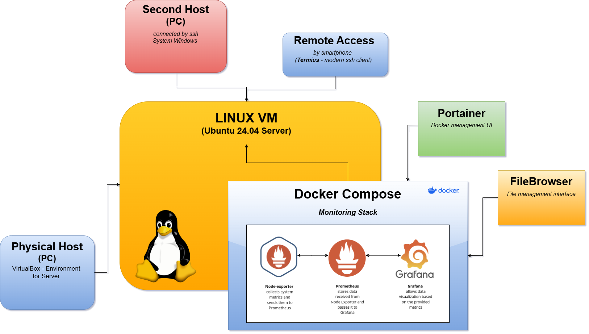

# Private Cloud File Server with Monitoring

> Self-hosted file server with system monitoring using Docker

---

## Overview

This project provides a private cloud file server running in a virtualized environment with built-in system monitoring.

The system is based on Docker containers and is accessible within a local network.

---

## Features

* File management via web interface (FileBrowser)
* Container management (Portainer)
* System monitoring (Prometheus + Grafana)
* Remote access via SSH
* Persistent data using Docker volumes
* Easy deployment with Docker Compose

---

## Architecture



---

## Repository Structure

```
.
├── docker-compose.yml
├── .gitignore
├── README.md
├── filebrowser/
│   ├── data/
│   ├── db/
│   │   └── filebrowser.db
│   └── config/
│       └── settings.json
├── portainer/
│   └── data/
└── monitoring/
    ├── prometheus/
    │   └── prometheus.yml
    └── grafana/
```

---

## Tech Stack

* Ubuntu Server 24.04 LTS
* Docker & Docker Compose
* VirtualBox
* Prometheus
* Grafana
* FileBrowser
* Portainer

---

## Getting Started

### 1. Requirements

* Docker
* Docker Compose

### 2. Run the project

```bash
docker compose up -d
```

### 3. Check containers

```bash
docker ps
```

### 4. Stop the project

```bash
docker compose down
```

---

## Services

| Service       | URL                           |
| ------------- | ----------------------------- |
| FileBrowser   | http://SERVER_IP:8080         |
| Portainer     | https://SERVER_IP:9443        |
| Prometheus    | http://SERVER_IP:9090         |
| Grafana       | http://SERVER_IP:3000         |
| Node Exporter | http://SERVER_IP:9100/metrics |

---

## Services Description

### FileBrowser

Web-based file manager that allows:

* uploading and downloading files
* managing directories
* browser-based access

---

### Portainer

Docker management UI:

* container monitoring
* image and volume management
* start/stop services

---

### Monitoring Stack

#### Node Exporter

Collects system metrics:

* CPU usage
* RAM usage
* disk usage

---

#### Prometheus

* collects metrics from Node Exporter
* stores time-series data

---

#### Grafana

* visualizes metrics
* dashboards and monitoring

---

## Environment

* Virtual machine running on VirtualBox
* Ubuntu Server 24.04 LTS
* Bridged network (server visible in LAN)
* Remote access via SSH (e.g. Termius)

---

## Project Status

✔ Fully functional
✔ All services deployed via Docker
✔ Monitoring operational

---


## Summary

This project demonstrates a complete self-hosted cloud solution with monitoring capabilities.
It is designed for local network usage and can be easily extended.
